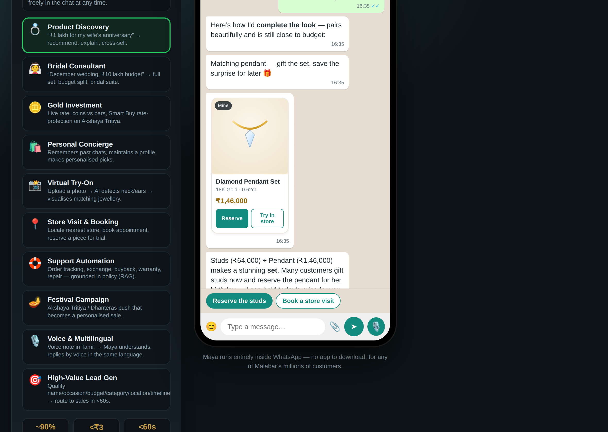
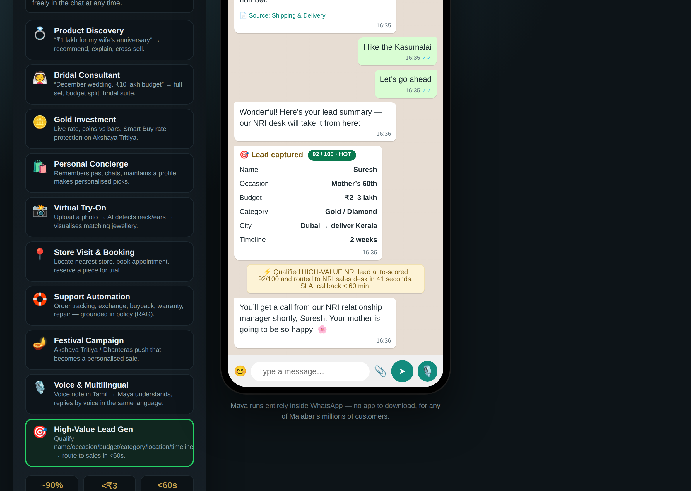
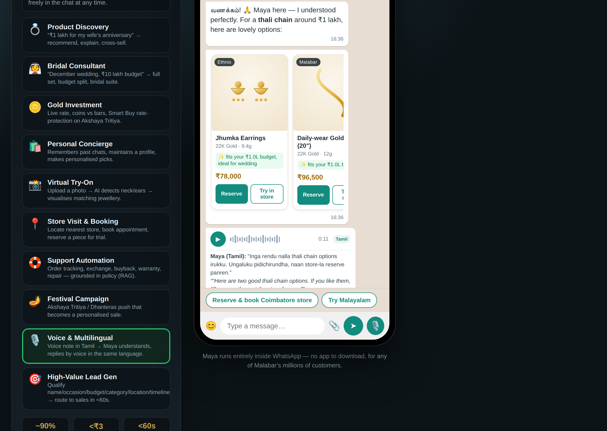

# Maya — WhatsApp AI Jewellery Concierge
### A next-generation conversational-commerce demo for **Malabar Gold & Diamonds**

> A production-credible prototype of an AI assistant that lives entirely inside WhatsApp and acts as a
> personal jewellery concierge — discovering products by budget/occasion, planning ₹10-lakh bridal
> trousseaus, advising on gold investment, automating support, running festival campaigns, handling
> voice notes in 6 Indian languages, and qualifying & routing high-value leads to sales in **under 60 seconds**.

<p align="center">
  
  
  
</p>

> ⚠️ **Demo disclaimer:** This is an independent prototype for a CEO presentation. Brand names,
> collections (Brides of Malabar, Mine, Era, Ethnix, Divine, Precia, Starlet, Mehrab, Viraaz) and
> services referenced are publicly known; **all SKUs, prices, KPIs and ROI figures are illustrative**
> and clearly labelled as such. Not a live Malabar service.

---

## ▶️ Run it in 30 seconds

**Option A — just open it (no install):**
```
open malabar-gold-whatsapp-demo/index.html        # macOS
# or double-click index.html / drag it into a browser
```

**Option B — local web server (recommended):**
```bash
cd malabar-gold-whatsapp-demo
node serve.js          # → http://localhost:5500
```

**Optional — run the mock backend API (zero dependencies):**
```bash
node backend/server.js # → http://localhost:8787  (try: curl localhost:8787/api/health)
```

There is **nothing to install** to run the demo or the backend — both use only built-in Node/browser
APIs. (Playwright is a dev-only dependency for the automated smoke test.)

### How to drive the demo
- Click any of the **10 scenarios** in the left rail to play it live.
- Tap the **green quick-reply chips**, or **type freely** — e.g. *“diamond ring under ₹1 lakh for anniversary”*, *“what’s your buyback policy?”*, *“today’s gold rate”*.
- Use the **language selector** (top-right) and the **🔄 reset** button.
- A suggested live-demo path is in the **[CEO Demo Script](docs/08-ceo-demo-script.md)**.

---

## 🎬 The 10 scenarios

| # | Scenario | What it shows | Marquee moment |
|---|----------|---------------|----------------|
| 1 | **Product Discovery** | Budget/occasion/metal/style search + AI reasoning + cross-sell | “₹1 lakh anniversary” → 3 picks + complete-the-look |
| 2 | **Bridal Consultant** | ₹10L budget *allocated* across a full bridal set, bridal-suite booking | The budget-allocation card |
| 3 | **Gold Investment** | Live rate, coins vs bars, **Smart Buy** rate-lock | Live gold-rate card on Akshaya Tritiya |
| 4 | **Personal Concierge** | Memory of past chats + a maintained customer profile | “Welcome back, Priya…” |
| 5 | **Virtual Try-On** | Photo upload → face/neck detection → on-photo visualisation | The AI try-on card |
| 6 | **Store Visit & Booking** | Nearest-store locator, appointment, reservation | Store card + appointment confirmation |
| 7 | **Support Automation** | Order tracking, buyback/exchange/warranty/repair — **grounded in policy via RAG** | Cited policy answers, <₹3/chat |
| 8 | **Festival Campaign** | Broadcast → personalised, converting conversation | Akshaya Tritiya campaign card |
| 9 | **Voice & Multilingual** | Voice notes in EN/HI/TA/TE/ML/KN, voice reply | Tamil/Malayalam voice bubble + transcript |
| 10 | **High-Value Lead Gen** | Qualify → auto-score → route to sales in <60s | The **92/100 · HOT** lead card |

---

## 📦 Deliverables (all 8 parts)

| Part | Deliverable | Location |
|------|-------------|----------|
| 1 | **Product Requirements Document** | [`docs/01-PRD.md`](docs/01-PRD.md) |
| 2 | **System Architecture** (7 Mermaid diagrams) | [`docs/02-architecture.md`](docs/02-architecture.md) |
| 3 | **Conversation Flows** (flowcharts for all 10 scenarios) | [`docs/03-conversation-flows.md`](docs/03-conversation-flows.md) |
| 4 | **UX / UI of the WhatsApp experience** | [`docs/04-ux-ui.md`](docs/04-ux-ui.md) |
| 5 | **55 realistic customer conversations** | [`docs/05-conversations.md`](docs/05-conversations.md) |
| 6 | **Clickable interactive demo** | `index.html` + `js/` + `css/` |
| 7 | **Complete source code** (frontend, backend, mock APIs, recommendation engine, RAG, voice stubs) | `js/`, `backend/` |
| 8 | **CEO Demo Script** (business case + Q&A) | [`docs/08-ceo-demo-script.md`](docs/08-ceo-demo-script.md) |
| — | Canonical brief (single source of truth) | [`docs/00-CANONICAL-BRIEF.md`](docs/00-CANONICAL-BRIEF.md) |

---

## 🧱 Source code map

```
malabar-gold-whatsapp-demo/
├─ index.html                  # WhatsApp-style UI shell (phone frame, header, thread, composer)
├─ serve.js                    # zero-dep static server (npm start)
├─ css/styles.css              # WhatsApp visual design (bubbles, cards, voice, typing, chips)
├─ js/
│  ├─ app.js                   # chat controller: renders messages, typing, quick replies,
│  │                           #   product cards, voice notes, try-on, lead cards; NLU for free text
│  ├─ data/
│  │  ├─ products.js           # catalog + inline-SVG product "photography" (works offline)
│  │  ├─ stores.js             # store directory
│  │  └─ scenarios.js          # the 10 branching scenario scripts (the demo content)
│  └─ engine/
│     ├─ recommendation.js     # transparent weighted recommender + cross-sell + bridal allocation
│     └─ rag.js                # curated knowledge base + keyword retriever (RAG stand-in)
├─ backend/                    # optional mock API server (mirrors the front-end engines)
│  ├─ server.js                # zero-dep HTTP API + WhatsApp Cloud API webhook stub
│  ├─ .env.example
│  └─ lib/
│     ├─ data.js               # canonical products / stores / knowledge
│     ├─ recommendation.js     # recommendation engine (REST)
│     ├─ rag.js                # RAG retriever (REST)
│     ├─ agent.js              # intent routing / orchestration + Claude tool-calling reference
│     └─ voice.js              # STT / multilingual TTS stubs
├─ docs/                       # Parts 1–5 & 8
└─ smoke-test.js               # headless Playwright test (race conditions, rendering, NLU)
```

### Backend API (mock) — quick reference
```
GET  /api/health                          POST /api/recommend   {budget,occasion,category,...}
GET  /api/rate                            POST /api/bridal-plan {budget}
GET  /api/products  ?cat= ?brand=         POST /api/rag         {query}
GET  /api/product/:id                     POST /api/agent       {message,profile}
GET  /api/stores    ?city=                POST /api/lead        {name,occasion,budget,city,timeline}
GET  /api/cross-sell/:id                  POST /api/appointment {storeId,kind,when,name}
POST /api/voice/transcribe {audioRef,langHint}    POST /api/voice/synthesize {text,lang}
GET/POST /webhook/whatsapp                # WhatsApp Cloud API verification + inbound message stub
```
Example:
```bash
curl -X POST localhost:8787/api/agent -d '{"message":"diamond ring under 1 lakh for anniversary"}'
curl -X POST localhost:8787/api/lead  -d '{"occasion":"Wedding","budget":"1000000","city":"Hyderabad","timeline":"December"}'
```

---

## 🏗️ How the demo maps to production

The demo is intentionally **front-end-first** so it runs anywhere with zero setup, but every piece has a
named production counterpart (detailed in [`docs/02-architecture.md`](docs/02-architecture.md)):

| Demo (this repo) | Production |
|---|---|
| Static browser chat UI | WhatsApp Business / Cloud API (interactive lists, buttons, media, Flows) |
| `js/app.js` scenario engine | Stateful agent orchestrator on a webhook gateway |
| `backend/lib/agent.js` rule router | **Claude** tool-calling loop (Opus 4.8 / Sonnet 4.6 / Haiku 4.5 by tier) |
| `engine/rag.js` keyword KB | Embeddings + vector store over catalog & policies |
| `engine/recommendation.js` weights | Hybrid rules + embedding similarity + collaborative filtering |
| `voice.js` stubs | Indic-language STT + multilingual TTS |
| In-memory profile card | CRM profile + consent (DPDP) + long-term memory |
| `/api/lead` scoring | Lead scoring → CRM → sales routing with SLA |

---

## ✅ Quality / verification

```bash
npm i playwright-core   # dev-only
node smoke-test.js      # boots the demo in headless Chromium and asserts:
                        #  • all 10 launchers present  • product cards & lead cards render
                        #  • free-text NLU → grounded RAG answer  • voice bubbles render
                        #  • no scenario "leakage" when switching scenarios mid-typing
                        #  • zero console errors
```

---

## 💡 Why this matters (one line per lever — full numbers in the [CEO script](docs/08-ceo-demo-script.md))

- **Revenue:** more interested customers converted, on the channel Indians already live on (~90% open rate).
- **AOV:** AI cross-sell / complete-the-look on every conversation.
- **Leads:** every chat is a qualified, scored, routed lead in <60s — no drop-off.
- **Cost:** ~70% of support self-served at **<₹3/chat** vs ₹45–70 with an agent.
- **Loyalty:** memory + vernacular voice reaches NRI, non-English and first-time buyers personally.
