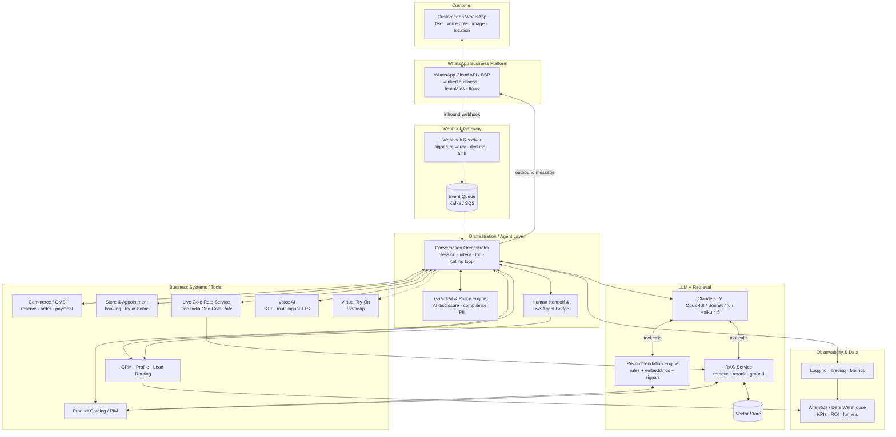
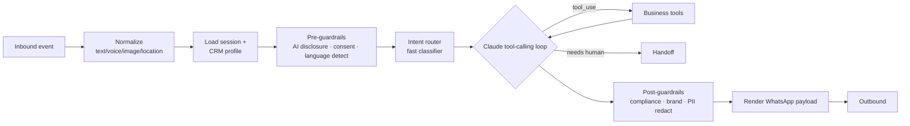
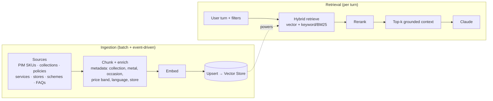
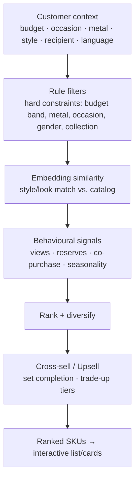
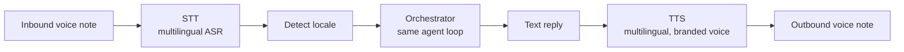
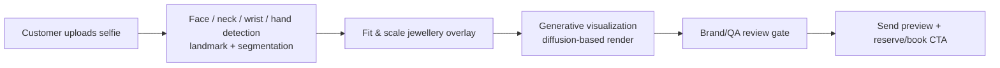
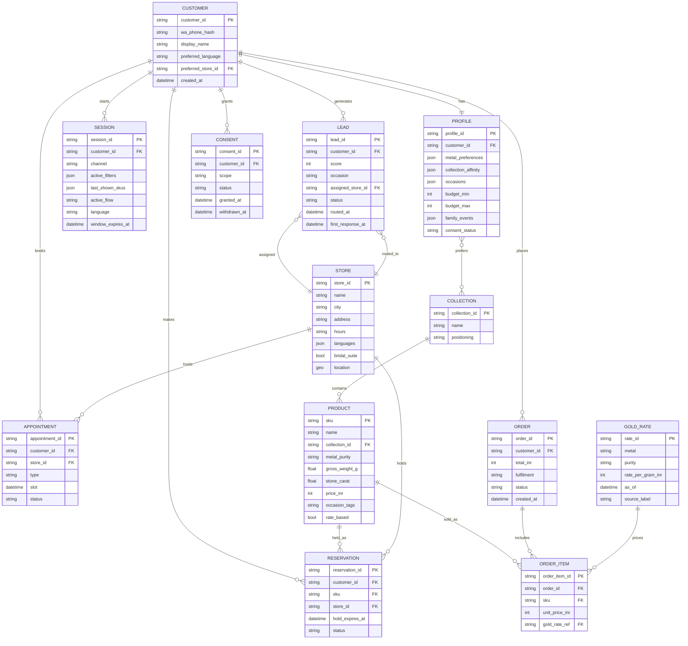
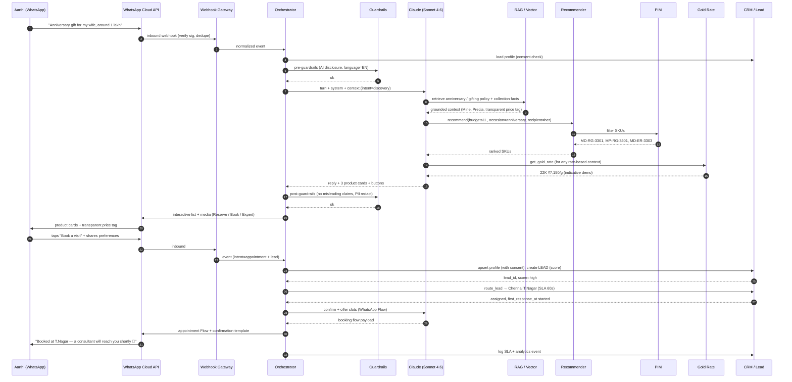
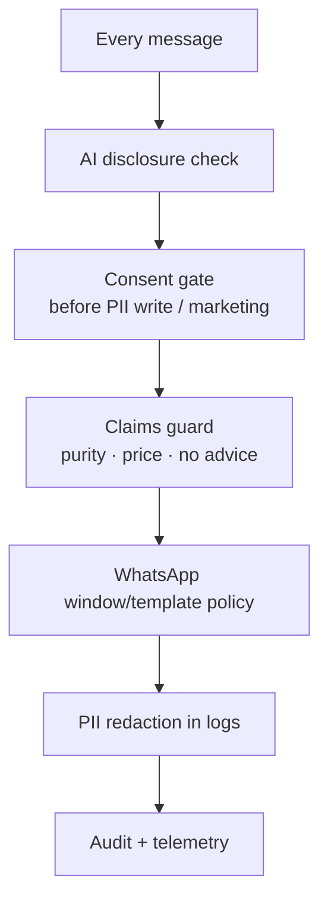
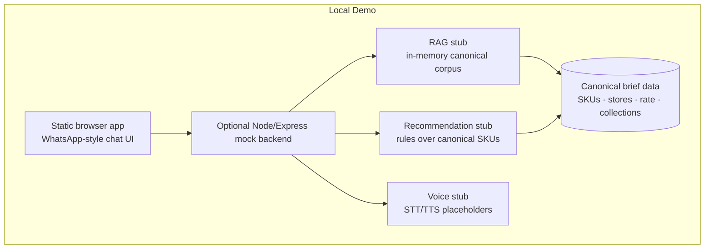

# System Architecture — Maya, the WhatsApp AI Jewellery Concierge

**Malabar Gold & Diamonds**
*Document 02 · System Architecture · Production reference design*

> Companion to `00-CANONICAL-BRIEF.md`. All brand facts, collection names, SKUs, prices, stores, personas, the demo "live" gold rate, and the trust/compliance language in this document are governed by the canonical brief. Figures are **illustrative for demo purposes** and are labelled as such where they appear in CEO-facing material.

---

## 1. Architecture Overview & Principles

Maya is a verified WhatsApp Business concierge ("Malabar Gold & Diamonds", green tick) that helps customers discover jewellery, understand pricing and trust programs, reserve products, book store/bridal appointments, track gold investment options against a live rate, and reach a human expert — across English, Hindi, Tamil, Telugu, Telugu, Malayalam, Kannada and Hinglish.

The architecture is a **stateless, event-driven, tool-calling agent** sitting behind the WhatsApp Cloud API. An orchestration layer receives webhooks, hydrates session + customer memory, routes intent, and lets a Claude LLM drive the conversation by calling well-typed business tools (catalog search, recommendation, gold rate, reservation, appointment, lead routing, human handoff). Knowledge that must be grounded — product specs, policies, collection stories — is retrieved from a RAG layer; volatile facts (gold rate, stock, store hours) come from live services, never from the model's memory.

### Design principles

| # | Principle | What it means in practice |
|---|---|---|
| 1 | **Grounded, never guessing** | Prices, purity, gold rate, stock, store hours and policies always come from a system-of-record via tools/RAG. The LLM composes and explains; it does not invent numbers. Every price is rendered with the canonical transparent price-tag breakdown. |
| 2 | **Tools over prose** | Business actions (reserve, book, route lead, fetch rate) are dedicated, typed, auditable tools — not free-text the model emits. This lets the harness gate, validate, log and rate-limit each action. |
| 3 | **Human always one tap away** | Maya discloses she is an AI on first contact and at any point can hand off to a store expert or bridal consultant. High-value leads are escalated proactively within the 60-second SLA. |
| 4 | **Memory with consent** | Short-term session state is implicit; long-term CRM memory (preferences, occasions, budget, family events) is written only after explicit, logged consent under the DPDP Act. |
| 5 | **Latency-tiered model routing** | Cheap/fast model for classification and small talk, mid-tier for most concierge turns, frontier model for bridal consultation, complex multi-constraint discovery and tool-heavy reasoning. |
| 6 | **Stateless compute, durable state** | Every webhook is processed statelessly; all state lives in datastores (session cache, CRM, vector DB, OMS). Horizontal scale and zero-downtime deploys come for free. |
| 7 | **Policy- & brand-safe by construction** | WhatsApp commerce policy, BIS hallmark claims, "no financial advice", AI disclosure and tone are enforced via system prompt + guardrail layer + template governance, not left to chance. |
| 8 | **Build-light, buy-the-commodity** | Buy the BSP, the LLM, the managed vector DB and STT/TTS; build the orchestration, tools, grounding and brand persona — the defensible parts. |

---

## 2. High-Level Architecture



**Read it as a loop:** an inbound WhatsApp message is verified and queued; the orchestrator hydrates session + CRM context, runs guardrails, and enters a Claude tool-calling loop; Claude grounds answers via RAG and live services and calls business tools to act; the orchestrator renders a WhatsApp-native reply (interactive list, buttons, media, template, or flow) and emits telemetry.

---

## 3. Component Deep-Dives

### 3.1 WhatsApp Business Platform Integration

Maya runs on the **WhatsApp Cloud API** (Meta-hosted) fronted by a **BSP** (Business Solution Provider) for verified business onboarding, the green-tick display name "Malabar Gold & Diamonds", template management, and number/scale operations.

**Message types in use:**

| Type | Use in Maya | Example |
|---|---|---|
| **Text** | Free-form concierge conversation, multilingual | "Show me anniversary gifts under ₹1.5L" |
| **Interactive — List** | Bounded choices: collections, occasions, budget bands, stores | "Choose a collection: Brides of Malabar · Mine · Era · Divine…" |
| **Interactive — Reply Buttons** | Up to 3 quick actions | `Reserve` · `Book a visit` · `Talk to an expert` |
| **Media (image/video/document)** | Product cards, the transparent price tag, BIS-hallmark proof, look-books, e-receipts | Sends `MD-RG-3301` image + spec PDF |
| **Location** | Inbound: customer shares location → nearest store; Outbound: store pin + directions | Nearest of Kozhikode / Chennai / Hyderabad / … |
| **Template (HSM)** | Business-initiated / outside 24h window: appointment reminders, reservation confirmations, gold-rate-lock alerts, Akshaya Tritiya/Dhanteras campaigns | "Your Smart Buy rate is locked at ₹7,150/g…" |
| **WhatsApp Flows** | Multi-field structured capture inside chat: bridal-consultation intake, appointment booking, lead qualification, try-at-home address | Bridal flow: date, city, budget, collection, language |
| **Voice notes** | Inbound audio → STT; outbound TTS audio replies | Tamil voice query from Divya (Coimbatore) |

**Conversation window & cost discipline.** Inside the 24-hour customer-care window, replies are free-form and free of per-message template cost; outside it, only approved templates may initiate. The orchestrator tracks window state per contact and chooses free-form vs. template automatically. Marketing/utility/authentication template categories are governed centrally (see §6).

**BSP options (build-vs-buy in §8):** Meta Cloud API direct, or a BSP such as Twilio, Gupshup, Infobip, Wati, or AiSensy. Recommendation: **Cloud API via an enterprise BSP** for verified onboarding, template governance, multi-number routing and India data-handling support, while keeping the agent logic provider-agnostic behind an internal `MessagingGateway` interface so the BSP can be swapped.

### 3.2 Agent Orchestration Layer

The orchestrator is the brain-stem: stateless per request, it turns a raw webhook into a grounded, policy-safe, WhatsApp-native reply.



- **Intent routing.** A cheap classifier (Haiku 4.5 or embedding+rules) tags each turn — `discovery`, `pricing`, `gold_rate`, `investment`, `bridal`, `reservation`, `appointment`, `order_status`, `policy_qna`, `complaint`, `human_request`, `smalltalk`. Routing decides model tier, which tools are exposed, and whether a proactive escalation fires.
- **Tool-calling.** The orchestrator runs Claude's tool-use loop: Claude requests tools (typed JSON schemas), the harness executes them against PIM/CRM/OMS/rate/RAG, returns results, and loops until `end_turn`. Each tool is dedicated and auditable (reserve, book, route lead) so the harness can gate destructive actions and validate inputs.
- **State / session.** Short-term state (last products shown, active flow, budget/occasion/metal filters, language, window timer) lives in a fast cache (Redis) keyed by WhatsApp contact ID, TTL ~24–72h. The Messages API itself is stateless; the harness resends the working history each turn and uses prompt caching on the stable system prefix.
- **Guardrails.** Pre-turn: language detection, AI-disclosure injection on first contact, consent check before any PII write, jailbreak/abuse screening. Post-turn: compliance checks (no misleading purity/price claims, no financial advice beyond product info), brand-tone conformance, PII redaction in logs, template-category enforcement.
- **Human handoff.** Triggered by explicit request, low confidence, complaint/sentiment, high-value lead, or policy edge cases. Opens a live-agent bridge (agent desktop / BSP inbox), passes full transcript + CRM context, flips the session to "human-controlled" so Maya stays silent until released, and logs SLA timestamps.

### 3.3 LLM Layer (Claude)

Maya uses **Anthropic Claude** with latency-tiered model routing. Models are selected per turn by the intent router to balance cost, latency and intelligence.

| Tier | Model | Model ID | Where used |
|---|---|---|---|
| **Fast / cheap** | Claude Haiku 4.5 | `claude-haiku-4-5` | Intent classification, language detection, small talk, FAQ deflection, short confirmations, voice-note transcription post-processing |
| **Balanced (default concierge)** | Claude Sonnet 4.6 | `claude-sonnet-4-6` | The default conversational turn: discovery, pricing explanation, reservations, appointment booking, policy Q&A grounded on RAG |
| **Frontier / reasoning** | Claude Opus 4.8 | `claude-opus-4-8` | Bridal consultation (₹10L multi-piece budgeting), complex multi-constraint discovery, multi-tool reasoning, sensitive complaint handling, investment guidance composition |

> Model IDs are exact, current Anthropic strings: Opus 4.8 = `claude-opus-4-8`, Sonnet 4.6 = `claude-sonnet-4-6`, Haiku 4.5 = `claude-haiku-4-5`. Do not append date suffixes.

**Inference configuration.**
- **Thinking / effort.** On Opus 4.8 and Sonnet 4.6 use **adaptive thinking** (`thinking: {type: "adaptive"}`) — Claude decides when to reason. Control depth/cost with the `effort` parameter inside `output_config` (`low`/`medium`/`high`): `low`–`medium` for routine concierge turns, `high` for bridal/complex reasoning. `budget_tokens` and sampling params (`temperature`/`top_p`/`top_k`) are not used on these models.
- **Streaming.** Stream long outputs (look-book narratives, bridal plans) so replies start fast and avoid HTTP timeouts; the orchestrator chunks the stream into WhatsApp-friendly message sizes.
- **Prompt caching.** The large, stable system prompt (persona, brand facts, trust programs, tool/policy instructions) is marked with `cache_control` so it is cached across turns and across customers; volatile context (live gold rate, this customer's profile, the current question) goes after the last cache breakpoint. Mid-conversation operator instructions (e.g. "human has taken over") are appended as `role:"system"` messages on Opus 4.8 to avoid invalidating the cached prefix.
- **Tool calling.** Business tools are defined as strict-schema tools; tool inputs are always JSON-parsed (never string-matched). Parallel tool calls (e.g. fetch rate + search catalog) return all results in a single user turn.

**System prompt (shape, not verbatim).** Persona "Maya" (warm, courteous luxury consultant, light emoji, concise, never pushy, always a next step); brand canon (founded 1993 Kozhikode; 300+ showrooms / 13+ countries; One India One Gold Rate; BIS hallmark; transparent price tag; lifetime maintenance; transparent buyback; Smart Buy; DGRP); collection map (Brides of Malabar, Mine, Era, Ethnix, Divine, Precia, Starlet, Mehrab, Viraaz); hard rules (always disclose AI + offer human; ground all prices/purity/rate via tools; no financial advice beyond product info; no misleading claims; obey DPDP consent); multilingual instruction (English, Hindi, Tamil, Telugu, Malayalam, Kannada, Hinglish — reply in the customer's language).

**Multilingual.** Claude handles the six languages + Hinglish natively for understanding and generation. Language is detected per turn and pinned for the reply; transliteration (e.g. Tamil in Latin script) is supported. STT/TTS (voice) reuse the same detected locale (§3.7).

### 3.4 RAG Pipeline

RAG grounds Maya on Malabar's own corpus so she explains accurately and on-brand, and never hallucinates policy or product facts.



- **Ingestion.** Product catalog (canonical SKUs), collection stories (the 9 sub-brands), policies (BIS hallmark, transparent price tag, lifetime maintenance, transparent buyback, exchange, free insured shipping, try-at-home, EMI), scheme mechanics (Smart Buy Advance Purchase, Smart Saver 11+1), store directory, and curated FAQs. Ingestion is event-driven from PIM/CMS webhooks plus a nightly reconcile.
- **Chunking.** Semantic chunks sized to one coherent idea (one SKU spec, one policy clause, one collection blurb), each tagged with rich metadata: `collection`, `metal/purity`, `occasion`, `price_band`, `language`, `store`, `doc_type`, `effective_date`.
- **Embeddings & vector DB.** Embeddings stored in a managed vector store (Pinecone / Weaviate / pgvector / OpenSearch — see §8) with metadata filtering so retrieval can be scoped (e.g. *Divine* + bridal + South-Indian).
- **Retrieval & grounding.** Hybrid (dense + lexical) retrieve → rerank → inject top-k into the Claude context with source attribution. The system prompt instructs Claude to answer only from retrieved + tool context for facts, and to say so / offer a human when context is missing.
- **Freshness for gold rate (critical).** The **live gold rate, stock, and store hours are never RAG-embedded.** They are fetched at request time from the live rate service / PIM / store system and injected as fresh tool results, timestamped and labelled "indicative demo rate — One India One Gold Rate". RAG holds the *explanation* of how rate-based pricing works; the *number* is always live. Any rate change invalidates dependent cached price computations.

### 3.5 Product Recommendation Engine

A hybrid recommender combining deterministic rules, semantic similarity, and behavioural signals, filtered by the customer's stated constraints.



- **Rules.** Hard constraints first: budget band, metal/purity (22K vs 18K diamond), occasion (bridal, anniversary, festive, gifting, investment), recipient (him/her/kids/self), and collection affinity. Example: anniversary gift ≤ ₹1.5L surfaces `MD-PD-3302` (₹1,46,000), `MD-RG-3301` (₹1,18,000), `MP-RG-3401` (₹89,000).
- **Embeddings.** Style/look similarity (temple, polki, solitaire-look, daily-wear) via product embeddings — finds visually/semantically adjacent SKUs beyond exact attribute matches.
- **Collaborative signals.** View/reserve/purchase and co-purchase patterns, plus seasonality (Akshaya Tritiya → coins/bars; Dhanteras → silver Lakshmi-Ganesha coin `MI-SC-9905`; wedding season → bridal sets).
- **Cross-sell / upsell.** Set completion (haram + bangles + jhumka for bridal), trade-up tiers (studs → solitaire-look ring → tennis bracelet), and scheme nudges (Smart Buy rate-lock, Smart Saver 11+1). Targets the canonical KPI of **+8–12% AOV via cross-sell** (illustrative).
- **Output.** Ranked, diversified SKUs rendered as WhatsApp media cards / interactive lists with the transparent price breakdown and a next step (reserve / book / try-at-home).

### 3.6 Customer Profile & Memory

Two layers, consent-gated.

| Layer | Store | Lifetime | Contents | Consent |
|---|---|---|---|---|
| **Short-term session** | Redis (cache) | ~24–72h TTL | Active filters, last products shown, current flow, language, window timer, transient intent | Implicit (operational) |
| **Long-term profile** | CRM (system of record) | Durable | Preferences (metal, collections, style), occasions/anniversaries, budget range, family events (wedding dates), past reservations/visits/purchases, preferred store & language, opt-ins | **Explicit, logged DPDP consent** |

- The orchestrator hydrates both at turn start and writes back deltas at turn end. Long-term writes (and any profile enrichment from conversation) require a recorded consent event; without consent, Maya operates session-only.
- Memory powers the canonical **+20% repeat purchase** goal (illustrative): remembering Lakshmi's December wedding, Mr. Menon's Akshaya Tritiya interest, Priya's Viraaz preference, Suresh's NRI gifting + delivery context.
- Consent, withdrawal, export and erasure are first-class operations (§6).

### 3.7 Voice AI (integration stubs)

Voice lets customers like Divya (Tamil) speak instead of type.



- **STT (speech-to-text).** Inbound WhatsApp audio → multilingual ASR (English, Hindi, Tamil, Telugu, Malayalam, Kannada). Candidate engines: Google Speech-to-Text, Azure Speech, Sarvam/AI4Bharat (strong Indic), or Deepgram. The transcript enters the normal agent loop; a Haiku pass can clean disfluencies and pin language.
- **TTS (text-to-speech).** Replies optionally returned as voice notes in the customer's language with a consistent, warm brand voice. Candidate engines: Azure Neural TTS, Google TTS, ElevenLabs, Sarvam.
- **Voice-note in/out** is a transport detail; the agent, tools, RAG and memory are unchanged. Stubs expose `transcribe(audio, locale?) → text` and `synthesize(text, locale) → audio` behind a `VoiceGateway` interface so engines can be swapped.

### 3.8 Virtual Try-On (roadmap)

Positioned as **roadmap**, with a feasibility note.



- **Today's feasibility:** earrings/pendant/necklace overlays via face+neck landmark detection are feasible with good UX; rings/bangles (hand/wrist) and faithful metal/stone material rendering are harder. Generative visualization can produce compelling previews but needs a **brand/QA gate** to prevent misrepresenting actual product (a compliance concern — see §6, "no misleading claims").
- **Recommendation:** ship as opt-in, clearly labelled "illustrative preview, not a substitute for in-store try-on / try-at-home", routed through human-review for bridal. Integrate as an async tool (`virtual_tryon(image, sku) → preview_url`) so the rest of the architecture is unaffected. Until GA, lean on the existing **try-at-home** and **video shopping / personal shopper** services.

### 3.9 Store Locator, Appointments, Reservation, Lead Routing

| Capability | Tool | Behaviour |
|---|---|---|
| **Store locator** | `find_stores(location \| city, filters)` | Customer shares location or city → nearest of the canonical stores (Kozhikode–Mavoor Road flagship, Chennai–T.Nagar, Hyderabad–Kukatpally, Bengaluru–Jayanagar, Mumbai–Borivali, Kochi–MG Road, Delhi–Karol Bagh, Dubai–Gold Souk). Returns address, hours (10:30–20:30), languages, bridal-suite (Y/N), and a location pin. |
| **Appointment booking** | `book_appointment(store, slot, type, customer)` | Store visit, **private bridal consultation** (bridal-suite stores), or video shopping. Driven via a WhatsApp Flow; confirmation + reminder via template. |
| **Try-at-home** | `request_try_at_home(sku[], address)` | Select-city service; captures address via Flow. |
| **Reservation** | `reserve_product(sku, store, hold_window)` | Holds a SKU at a chosen store; confirmation via template; feeds OMS + CRM. |
| **Lead routing** | `route_lead(profile, score, store, channel)` | Scores and routes qualified leads to the right store/sales desk. **High-value leads → sales within 60s** (canonical SLA). Bridal/HNI leads escalate to a named consultant. |

Lead routing integrates with CRM and the live-agent bridge; routing rules consider budget, occasion (bridal/investment), recipient, store proximity and language, and emit SLA telemetry to analytics.

### 3.10 Live Gold Rate Service

The single source of truth for the rate, isolated so it can be refreshed and cached independently.

- **Source.** Internal "One India One Gold Rate" feed (or market feed mapped to it). Demo values (canonical): **22K ₹7,150/g, 24K ₹7,800/g, Silver ₹95/g**, timestamped and labelled *"indicative demo rate — One India One Gold Rate"*.
- **Service shape.** `get_gold_rate(metal, purity) → {rate, unit, timestamp, source_label}`; short TTL cache (e.g. 60–300s) with publish-on-change. Pushes invalidations to dependent price computations and powers **Smart Buy Advance Purchase** rate-lock (deliver at the lower of booked vs. prevailing) and **Smart Saver 11+1**.
- **Pricing composition.** Investment SKUs (`MI-GC-9901` 1g coin = live rate + 3% premium; coins/bars by live rate) and making-charge math are computed at request time from the live rate, never embedded in RAG. Rate-lock alerts go out via utility templates.

---

## 4. Data Model

Key entities and relationships.



| Entity | System of record | Notes |
|---|---|---|
| Customer, Profile, Consent, Lead | CRM | Long-term, consent-gated |
| Session | Redis cache | Ephemeral, TTL'd |
| Product, Collection | PIM | Canonical SKUs & sub-brands |
| Store | Store/locator system | Hours, languages, bridal-suite |
| Appointment | Appointment system | Visit / bridal / video / try-at-home |
| Reservation, Order, Order_Item | OMS / commerce | `gold_rate_ref` ties price to the rate as-of |
| Gold_Rate | Live rate service | Timestamped; never RAG-embedded |

---

## 5. Sequence — Product Discovery + Lead Capture (end to end)

Scenario: **Aarthi (Chennai, 28)** wants an anniversary gift for her wife, ~₹1L budget.



---

## 6. Security, Privacy (DPDP), Compliance, PII & WhatsApp Policy

### Data protection & DPDP Act (India)
- **Consent-first.** Explicit, purpose-specific, logged consent before any long-term profile write or marketing template. Consent records (`CONSENT` entity) capture scope, timestamp, and withdrawal.
- **Data-principal rights.** Support access, correction, withdrawal, and erasure; honor "delete my data" via CRM + cache purge + analytics anonymization. Memory-version redaction for any captured free-text containing PII.
- **Data minimisation & purpose limitation.** Store only what serves concierge/commerce; the WhatsApp phone number is hashed/tokenised at rest; no sensitive financial data persisted by Maya.
- **Residency.** Prefer India-region hosting for CRM/session/analytics and India-supporting BSP; document cross-border processing (LLM, STT/TTS) in the privacy notice.

### PII handling
- PII is redacted from logs and traces; secrets (BSP tokens, API keys) live in a secrets manager, never in prompts or message history.
- Least-privilege access to CRM/OMS; full audit trail on profile reads/writes and tool actions.
- Encryption in transit (TLS) and at rest; tokenisation of identifiers.

### Brand / regulatory compliance (canonical)
- **AI disclosure** on first contact and on request; human handoff always available.
- **BIS hallmark claims** stated accurately; **no misleading purity or price claims** — every price uses the transparent price-tag breakdown grounded on PIM + live rate.
- **No financial advice** beyond product information for investment products (coins/bars/schemes); Smart Buy/Smart Saver explained mechanically, not as advice.
- Virtual try-on previews labelled "illustrative".

### WhatsApp Business Policy
- Verified business, accurate display name, opt-in capture before business-initiated messages.
- 24-hour customer-care window respected; outside it, only approved templates (correct category: utility/marketing/authentication).
- No prohibited content; commerce policy adherence; template governance to prevent misleading promotions.
- Per-number rate limits and quality-rating monitoring to protect deliverability.



---

## 7. Scalability, Latency Budget, Observability, Cost

### Scalability
- Stateless webhook receivers and orchestrator workers scale horizontally behind a queue (Kafka/SQS) that absorbs campaign spikes (Akshaya Tritiya, Dhanteras, wedding season) and smooths LLM/tool back-pressure.
- Datastores scale independently: Redis (session), managed vector DB (RAG), CRM/OMS (transactional). Multi-number/BSP routing for high concurrency.
- Idempotent webhook processing (dedupe on message ID) handles WhatsApp at-least-once delivery.

### Latency budget (target per concierge turn, illustrative)

| Stage | Budget |
|---|---|
| Webhook ingest + normalize | ~50 ms |
| Session + CRM hydration | ~80 ms |
| Intent classify (Haiku) | ~150 ms |
| RAG retrieve + rerank | ~200 ms |
| Tool calls (catalog/rate) | ~150 ms |
| LLM generation (Sonnet, streamed) | ~1.0–2.5 s to first chunk |
| Render + send | ~80 ms |
| **Perceived total (first content)** | **~2–4 s** |

Levers: model tiering (Haiku for routing), prompt caching of the stable prefix, streaming, parallel tool calls, and short-TTL caches for rate/stock.

### Observability
- Structured logs (PII-redacted), distributed tracing across webhook → orchestrator → LLM → tools, and metrics: turn latency, tool latency/error rate, deflection rate, handoff rate, lead-routing SLA adherence, language mix, model-tier mix, token usage, WhatsApp quality rating.
- Per-turn token/cost capture from `usage` (input/output/cache read/write) feeds the cost model and analytics warehouse.

### Cost model (illustrative, per canonical KPIs)
- **Cost-to-serve:** human chat ₹45–₹70 → AI deflects ~70% at **< ₹3** (canonical, demo).
- Cost drivers: WhatsApp conversation/template fees (BSP), LLM tokens (minimised via tiering + caching), STT/TTS minutes, vector DB + infra. Frontier (Opus 4.8) reserved for high-value bridal/complex turns keeps blended token cost low while protecting quality where it matters.
- KPI framing (illustrative): +15–25% lead-to-store conversion, +8–12% AOV, 40–60% support-cost reduction, 3–5× faster lead response, +20% repeat purchase.

---

## 8. Tech Stack & Build-vs-Buy

| Layer | Recommendation | Alternatives | Build / Buy |
|---|---|---|---|
| **Messaging / BSP** | WhatsApp Cloud API via enterprise BSP (Gupshup / Twilio / Infobip) | AiSensy, Wati, Meta direct | **Buy** (abstract behind `MessagingGateway`) |
| **Webhook gateway / queue** | Cloud functions/containers + Kafka or SQS | Pub/Sub, RabbitMQ | **Build** (thin) |
| **Orchestration / agent** | Custom service (tool-calling loop, guardrails, handoff) | — | **Build** (core IP) |
| **LLM** | Anthropic Claude — Opus 4.8 / Sonnet 4.6 / Haiku 4.5 | — | **Buy** |
| **RAG / embeddings** | Managed embeddings + vector DB | Pinecone, Weaviate, pgvector, OpenSearch, Vertex/Bedrock KB | **Buy** vector DB, **Build** pipeline |
| **Recommendation** | Hybrid rules + embeddings + signals service | Managed reco (Vertex, etc.) | **Build** |
| **CRM / leads** | Existing CRM (Salesforce/Zoho/HubSpot or in-house) | — | **Buy / integrate** |
| **Commerce / OMS** | Existing OMS + payments (EMI) | — | **Buy / integrate** |
| **Appointments / store** | Booking system + store directory | Calendly-class / in-house | **Buy / integrate** |
| **Gold rate service** | Internal One India One Gold Rate feed wrapper | Market feed adapter | **Build** (thin) |
| **Voice (STT/TTS)** | Indic-strong ASR/TTS (Google, Azure, Sarvam/AI4Bharat, ElevenLabs, Deepgram) | — | **Buy** (abstract behind `VoiceGateway`) |
| **Virtual try-on** | Roadmap: landmark detection + diffusion render + QA gate | CV/AR vendors | **Buy + Build** (later) |
| **Session cache** | Redis | Memcached | **Buy/managed** |
| **Observability** | OpenTelemetry + logs/metrics/traces + warehouse | Datadog, Grafana, BigQuery/Snowflake | **Buy/integrate** |

**Buy** the commodities (BSP, LLM, vector DB, STT/TTS, CRM/OMS); **build** the defensible middle — orchestration, tools, grounding, recommendation and the Maya persona — behind clean interfaces so any single vendor can be swapped.

---

## 9. How the Local Demo Maps to This Architecture

The included demo is a **static browser app + optional Node/Express mock backend** that faithfully *simulates* this production design without the heavyweight integrations — so a CEO can experience Maya end-to-end.



| Production component | Demo simplification |
|---|---|
| WhatsApp Cloud API / BSP | Browser chat UI mimicking WhatsApp (bubbles, interactive lists, buttons, media cards) |
| Webhook gateway + queue | Direct in-app calls / simple Express routes — no signature verify, no queue |
| Orchestration + tool loop | Mock backend (or in-browser) routing logic + canned tool dispatch |
| Claude LLM (tiered) | Scripted/persona-driven responses (or optional live Claude call) keyed to canonical personas |
| RAG + vector DB | In-memory canonical corpus with keyword/simple-similarity lookup (**stub**) |
| Recommendation engine | Deterministic rules over the canonical SKU list (**stub**) |
| PIM / CRM / OMS / appointments | Static JSON fixtures from the brief; reservations/bookings are simulated |
| Live gold rate service | Hardcoded canonical demo rate (22K ₹7,150 / 24K ₹7,800 / Silver ₹95), labelled indicative |
| Voice (STT/TTS) | Placeholder stubs / pre-recorded clips (**stub**) |
| Virtual try-on | Static "coming soon" preview placeholder |
| Security / DPDP / observability | Illustrated in copy + a simple consent toggle; not a full compliance stack |

**The mapping is 1:1 in shape, simplified in depth:** every production box has a demo counterpart, the data is the canonical brief's, and the interfaces (messaging, RAG, recommendation, rate, voice) are the same seams that get swapped for real services in production. The demo proves the *experience and flows*; production swaps the stubs for the live BSP, Claude tiers, managed vector DB, real PIM/CRM/OMS, the One India One Gold Rate feed, and Indic STT/TTS — with no change to the conversation design.
```
