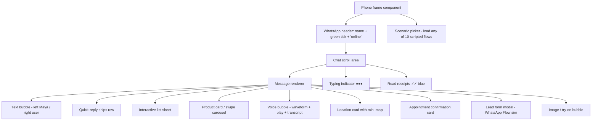

# UX / UI — Malabar Gold & Diamonds WhatsApp AI Agent ("Maya")

> Companion to `00-CANONICAL-BRIEF.md` and `03-conversation-flows.md`. Describes the on-screen WhatsApp experience, the component library, key screens per scenario, and how the included browser demo recreates it. All SKUs, prices, stores and the demo gold rate (22K ₹7,150/g · 24K ₹7,800/g · Silver ₹95/g — *indicative demo rate, One India One Gold Rate*) are canonical. Figures are **illustrative for demo purposes**.

---

## 1. Design Principles for WhatsApp Commerce

| Principle | What it means for Maya |
|---|---|
| **Native feel** | Use only real WhatsApp components (lists, reply buttons, product cards, Flows, location, voice). No fake UI — the experience should look identical to any WhatsApp chat. |
| **Low friction** | Tap-first over type-first. Every question offers buttons. Never ask for data we can infer or already have. Max 3 options per decision, max 3 cards per turn. |
| **Mobile-first** | Short bubbles (1 idea each), thumb-reachable buttons, images that read well at phone width, prices always visible on cards. |
| **Conversational, not form-y** | Forms (WhatsApp Flows) only for structured capture (booking, lead, KYC, address). Everything else is chat. |
| **Trust-forward** | Surface BIS Hallmark, transparent price tag, lifetime maintenance, buyback wherever relevant — Malabar's "brand of trust" must feel present. |
| **Always a next step** | Every screen ends with a clear CTA: reserve, book, locate, or talk to a human. |
| **Respectful** | AI disclosure, consent, easy STOP, language match, accessibility (text alongside voice). |

---

## 2. Verified Business Profile

```
┌────────────────────────────────────────────┐
│  ⟨ photo ⟩  Malabar Gold & Diamonds  ✅      │  ← green verified tick
│            Business · Jewellery              │
├────────────────────────────────────────────┤
│  About                                       │
│  The brand of trust 💛 BIS Hallmarked gold,  │
│  transparent pricing, lifetime maintenance.  │
│  Chat with Maya, our AI jewellery concierge. │
│                                              │
│  📞 +91-XXXXXXXXXX   🌐 malabargoldanddiamonds.com │
│  🕙 10:30–20:30 IST · 300+ showrooms          │
│  🛍️ Catalog  ▸  (Gold · Diamond · Gemstone · │
│                  Coins · Bridal)             │
│  📍 Address: Mavoor Road, Kozhikode (HQ)      │
└────────────────────────────────────────────┘
```
- **Display name:** Malabar Gold & Diamonds · **Green tick** (Official Business Account).
- **About:** trust pillars + AI concierge disclosure.
- **Catalog:** linked WhatsApp Catalog grouped by Gold / Diamond / Gemstone / Coins & Bars / Bridal, populated with canonical SKUs.
- **Greeting message** + **away message** (after 20:30: "Maya's here 24/7 — store experts reply 10:30–20:30 IST").

---

## 3. Message Component Library

Each component below is used across the 10 scenarios. Mockups use markdown chat bubbles; `[ ]` = tappable.

### 3.1 Text bubble (Maya)
```
┌──────────────────────────────────────┐
│ ✨ Namaste! I'm Maya, your jewellery   │
│ concierge at Malabar 💛 I'm an AI —    │
│ a store expert is one tap away.        │
└──────────────────────────────────────┘ 10:24 ✓✓
```

### 3.2 Quick-reply buttons (max 3)
```
┌──────────────────────────────────────┐
│ What are you looking for today?        │
└──────────────────────────────────────┘
  [ 🔎 Explore ]  [ 👰 Bridal ]  [ 🪙 Gold rate ]
```

### 3.3 Interactive list (the master menu)
```
┌──────────────────────────────────────┐
│ How can I help? ▾  [ View options ]    │
└──────────────────────────────────────┘
   ▸ tapping opens:
   ───────── Choose one ─────────
   🔎 Explore jewellery
   👰 Plan a bridal look
   🪙 Gold rate & investment
   🛍️ Personal shopper
   📸 Virtual try-on
   📍 Visit a store
   🛠️ Order / support
   🎉 Festival offers
   🗣️ Talk in my language
```

### 3.4 Product card / carousel (image + title + price + CTA)
```
┌──────────────────────────────────────┐
│  ▢▢▢  [   product image   ]            │
│  Diamond Pendant Set · Mine            │
│  18K · 0.62ct · BIS Hallmark           │
│  ₹1,46,000                             │
│  [ View ]  [ Reserve ]  [ Try on 📸 ] │
└──────────────────────────────────────┘
   ◂ swipe ▸  (Studs ₹64,000 · Ring ₹1,18,000)
```

### 3.5 Media — image
```
┌──────────────────────────────────────┐
│ [ ✨ rendered / lifestyle image ✨ ]   │
└──────────────────────────────────────┘
```

### 3.6 Media — voice note
```
┌──────────────────────────────────────┐
│ ▶ ▁▂▃▅▇▅▃▂▁▁▂▃   0:08   🔊            │  ← Maya voice reply
└──────────────────────────────────────┘
  (paired with a text transcript bubble below)
```

### 3.7 Location card
```
┌──────────────────────────────────────┐
│  [ ▦ mini-map preview ▦ ]              │
│  Malabar Gold — Chennai, T. Nagar      │
│  Usman Road · 10:30–20:30              │
│  Languages: Tamil, English, Hindi      │
│  Bridal suite: ✅                       │
│  [ Get directions ]  [ Book visit ]   │
└──────────────────────────────────────┘
```

### 3.8 Appointment / booking confirmation card
```
┌──────────────────────────────────────┐
│  ✅ Appointment confirmed               │
│  Private Bridal Consultation           │
│  📍 Hyderabad — Kukatpally             │
│  📅 Sat, 28 Jun · 🕓 4:30 PM           │
│  👤 RM: Ms. Anitha (Bridal Specialist) │
│  Ref #MB-4821                          │
│  [ Add to calendar ] [ Reschedule ]   │
└──────────────────────────────────────┘
```

### 3.9 Lead form (WhatsApp Flow)
```
┌──────────────────────────────────────┐
│ Tell us a little, so a specialist can  │
│ help 💛   [ Open form ]                │
└──────────────────────────────────────┘
   ▸ opens an in-app Flow:
   ── Bridal enquiry ─────────────
   Name        [____________]
   City        [ Hyderabad ▾ ]
   Wedding date[  28/12/2026 ]
   Budget      ( ) 1–3L (•) 3–10L ( ) 10L+
   Style       [ Temple ▾ ]
   [ Submit ▸ ]
```

### 3.10 Typing indicator & read receipts
```
Maya is typing…        ●●●
... your message        10:24 ✓✓ (blue = read)
```

---

## 4. Annotated Key Screens — all 10 Scenarios

Each scenario shows its signature screen as a chat mockup.

### Scenario 1 — Product Discovery
*Customer browses; Maya returns 2–3 cards with prices + CTAs.*
```
You:  show me diamond pendants under 1.5L
Maya: Lovely pick 💎 Here are my top 3, all BIS Hallmarked:

┌─ Diamond Pendant Set · Mine ──────────┐
│ 18K · 0.62ct · ₹1,46,000               │
│ [ View ] [ Reserve ] [ Try on 📸 ]    │
└────────────────────────────────────────┘
┌─ Diamond Studs · Viraaz ──────────────┐
│ 18K · 0.30ct · ₹64,000                 │
│ [ View ] [ Reserve ] [ Try on 📸 ]    │
└────────────────────────────────────────┘
  [ Show more ]  [ Lower budget ]  [ Talk to expert ]
```

### Scenario 2 — Bridal Consultant
*Curated bridal lookbook + booking the bridal suite.*
```
Maya: Congratulations on your December wedding! 👰💛
      For a South-Indian temple look, I love these:

┌─ Lakshmi Temple Haram · Divine ───────┐
│ 22K · 48.2g · ₹3,85,000                │
└────────────────────────────────────────┘
┌─ Polki Bridal Necklace · Era ─────────┐
│ 18K + uncut diamonds · ₹6,90,000       │
└────────────────────────────────────────┘
  [ Book bridal suite ]  [ See full set ]  [ Call me ]

You: book bridal suite
Maya: ✅ Booked — see confirmation card. A bridal RM is assigned.
```

### Scenario 3 — Gold Investment Advisor
*Live rate bubble + coins/bars + schemes.*
```
Maya: 🪙 Today's indicative rate (One India One Gold Rate)
      22K ₹7,150/g · 24K ₹7,800/g · Silver ₹95/g
      ⏱ 25 Jun, 10:24 IST · BIS Hallmark

  [ Buy coin ]  [ Save monthly ]  [ Lock the rate ]

┌─ Gold Coin 1g · 999.9 ────────────────┐
│ ₹ live-rate + 3% premium · BIS         │
│ [ Reserve ]                            │
└────────────────────────────────────────┘
```

### Scenario 4 — Personal Shopping Concierge
*Memory-driven greeting + cross-sell.*
```
Maya: Welcome back, Suresh 💛 Last time you admired the
      Mine pendant. Shopping for your mother in Kerala again?

  [ Yes, gifting ]  [ Something else ]

Maya: This pairs beautifully with matching studs — shall I add them?
  [ Add studs (+₹64,000) ]  [ Just the pendant ]
      🚚 Free insured shipping Dubai → Kerala · transparent buyback
```

### Scenario 5 — Virtual Try-On
*Upload selfie → rendered image → act.*
```
Maya: Send me a clear selfie and I'll show the Jhumkas on you 📸
      (Your photo isn't stored — used only to render.)
You:  [ 📷 selfie.jpg ]
Maya: Maya is typing…  ●●●
Maya: [ ✨ you wearing Jhumka Earrings ✨ ]
      Gorgeous on you! 💛
  [ Reserve ₹78,000 ]  [ Try another ]  [ Book store try ]
```

### Scenario 6 — Store Visit Conversion
*Location card + slot booking.*
```
Maya: Share your location and I'll find the nearest showroom 📍
You:  [ 📍 location ]
Maya:
┌─ Malabar Gold — Bengaluru, Jayanagar ─┐
│ 10:30–20:30 · Kannada/Tamil/English    │
│ Bridal suite ✅                         │
│ [ Get directions ]  [ Book visit ]    │
└────────────────────────────────────────┘
  [ Sat 4:30 ]  [ Sun 11:00 ]  [ Other time ]
```

### Scenario 7 — Customer Support Automation
*Intent buttons → resolution → CSAT.*
```
You:  where is my order
Maya: Sure — what's your order ID? (e.g. MG-XXXX)
You:  MG-7781
Maya: 📦 Order MG-7781 · Diamond Studs (Viraaz)
      Status: Dispatched · ETA 27 Jun · Insured shipping
  [ Track ]  [ Need help ]
Maya: Did that help?   [ 👍 ]  [ 👎 → human ]
```

### Scenario 8 — Festival Campaigns
*Broadcast template with header image + CTA.*
```
┌─ Malabar Gold & Diamonds ✅ (broadcast) ─┐
│ [ 🎉 Akshaya Tritiya banner image 🎉 ]   │
│ Auspicious gold awaits! Reserve your      │
│ coin at today's rate 💛                   │
│ [ Shop coins ]  [ Festive jewellery ]    │
│ Reply STOP to opt out                     │
└────────────────────────────────────────────┘
  ▸ Shop coins →
┌─ Silver Lakshmi-Ganesha Coin 10g ─────┐
│ ₹1,150 · BIS · [ Reserve ]            │
└────────────────────────────────────────┘
```

### Scenario 9 — Voice AI (Multilingual)
*Voice in → voice + transcript out, language matched.*
```
You:  ▶ ▁▂▃▅▇▃▁  0:05  (Tamil: "Inraikku thanga vilai enna?")
Maya: ▶ ▁▂▃▅▇▅▃  0:09  🔊  (Tamil voice reply)
Maya: இன்றைய 22K தங்க விலை ₹7,150/கிராம் (குறிப்பிட்ட விலை).
      கோயில் தாலி செட் காட்டவா? 💛
      [Today's 22K gold rate is ₹7,150/g. Show a temple thaali set?]
  [ ஆம் / Yes ]  [ கடைக்கு வா / Visit store ]  [ Type instead ]
```

### Scenario 10 — High-Value Lead Generation
*Flow lead form → HOT tag → <60s specialist bridge.*
```
Maya: A ₹10L bridal deserves a dedicated specialist 💛
      A quick form and I'll connect you in under a minute.
      [ Open enquiry form ]
You:  [ ✅ submitted: Lakshmi · Hyderabad · 10L+ · Temple ]
Maya: Thank you, Lakshmi! 🔔 Connecting you now…
      ── A specialist has joined this chat ──
      👤 Ms. Anitha (Senior Bridal Consultant) · replies in ~1 min
```

---

## 5. Specialised UI Patterns (detail)

### 5.1 Voice note UI
- Inbound and outbound waveform bubbles with duration + speaker side.
- **Every** Maya voice note is paired with a **text transcript bubble** (accessibility + price accuracy).
- Prices/numbers always repeated in text. Language-switch chip: `[ Type instead ]`.
- Synthetic-voice AI disclosure on first voice reply.

### 5.2 Image-upload / try-on UI
```
[ + ]  →  📷 Camera   🖼️ Gallery
Maya prompt: "Send a clear, front-facing selfie 📸"
Privacy line under prompt: "Not stored · used only to render"
While rendering: "Maya is typing… ●●●"  (processing state)
Result: full-width image bubble + reply buttons (Reserve / Try another / Book)
Fallback: [ Use a model instead ] if customer prefers not to upload
```

### 5.3 Store-locator map card
- Header **mini-map preview** (static map image), pin on store.
- Body: store name, address, hours (10:30–20:30), languages spoken, bridal-suite flag.
- CTAs: `[ Get directions ]` (opens maps URL) · `[ Book visit ]`.
- Triggered by **location request** button or city text.

### 5.4 Appointment confirmation card
- Green ✅ header, appointment type, store, date/time, assigned RM, reference number.
- CTAs: `[ Add to calendar ]` `[ Reschedule ]`.
- Auto reminders: 24h + 2h before (template messages).

---

## 6. Accessibility & Multilingual Rendering

- **Voice ↔ text parity:** every voice note carries a transcript; every price stated in text.
- **Script rendering:** native scripts (Devanagari, Tamil, Telugu, Malayalam, Kannada) plus transliteration when helpful; numerals in Arabic digits for clarity.
- **Tap-first:** all key actions reachable via buttons (no mandatory typing) — helps low-literacy and motor-impaired users.
- **Contrast & size:** rely on WhatsApp's native large-text / dark-mode support; don't bake text into images that can't scale.
- **Concise bubbles:** one idea per bubble aids screen readers and cognitive load.
- **Language switch** always available; unsupported dialect → graceful English/text fallback + language-matched human.
- **Consent & STOP** instructions in the customer's language.

---

## 7. How the Browser Demo Recreates This

The included browser demo simulates the WhatsApp experience inside a **phone frame** so reviewers (CEO/stakeholders) can feel the UX without a live number.



**Recreated elements:**
- **Phone frame:** device bezel + WhatsApp green header showing "Malabar Gold & Diamonds ✅" and "online".
- **Chat bubbles:** left-aligned (Maya, white/grey) vs right-aligned (user, green), timestamps + ✓✓ read receipts.
- **Quick-reply chips:** rounded tappable chips below a bubble; clicking advances the scripted flow.
- **Product cards:** image + title + sub-brand + spec line + price + CTA buttons; horizontal swipe for the carousel.
- **Voice bubble:** animated waveform, play control, duration, and the paired transcript bubble.
- **Typing indicator:** animated `●●●` shown before Maya's scripted replies (and during try-on "render").
- **Interactive list / lead form:** modal sheet mimicking WhatsApp list and Flow form.
- **Location & appointment cards:** static map preview + confirmation card with reference + RM.
- **Scenario picker:** lets the reviewer load any of the 10 canonical flows; messages play out with realistic pacing.
- **Multilingual:** demo includes the Tamil/Hindi/etc. voice-AI script with transcript bubbles to show language parity.

The demo is presentation-grade: scripted, deterministic, and visually faithful to native WhatsApp — designed to showcase the flows in `03-conversation-flows.md` end-to-end.
